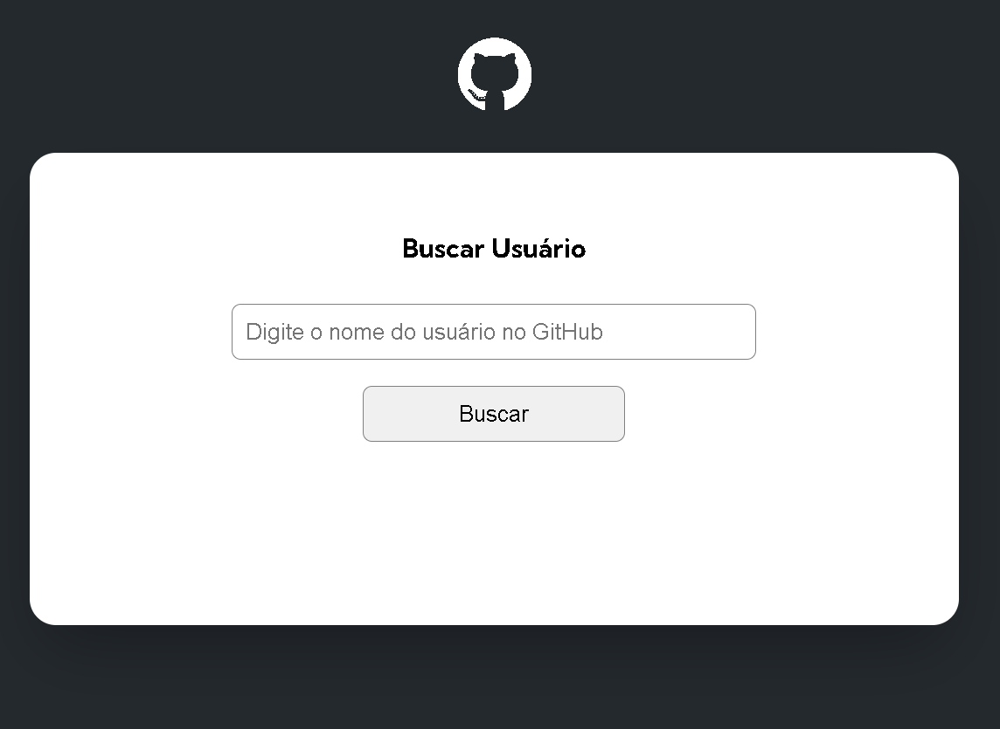
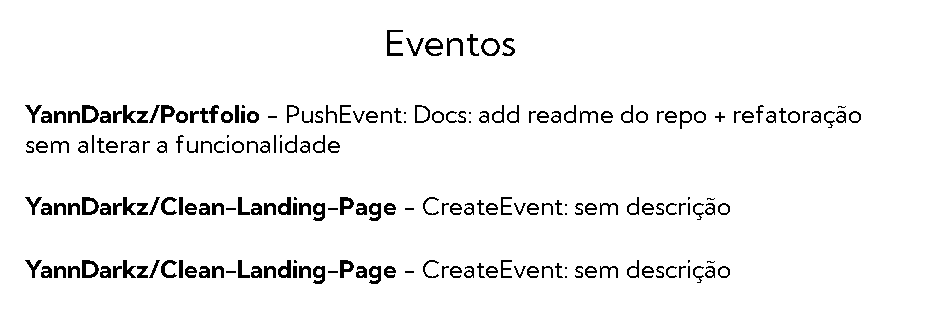

# Projeto Busca de Usuários GitHub com API
* Este projeto tem como objetivo Buscar os usuários do Github.

## Como Utilizar
* Para estar utilizando a ferramenta de busca de usuários do Github corretamentente, é preciso escrever o nome de usuário da pessoa desejada no Input/Caixa de texto, e logo depois clicar no botão "Buscar" ou pressionar a tecla enter. 

[
    
]

## Funcionalidades
* Depois do usuário ser enviado aparecerá o seuintes detalhes:

* Foto de perfil do usuário
* Nome e Bio do usuário
* Quantidade de Seguidores e Seguindo
* Lista com os 10 repositórios alterados recentemente. obs(Se o usuário ter menos que 10 repositórios, mostrará todos.)
*Lista com os ultimos 10 eventos feitos nos respectivos repositórios.

[
    
    
]

### Linguagens Utilizadas
* HTML
* CSS
* JavaScript

#### Desafios e Apredizados
* Esse projeto mesmo sendo simples, serviu como uma fonte de aprendizado, aprendi conceitos novos pesquisanso minha dúvidas, e, adquirindo também mais facilidade em manipular os dados retornados da API.  

